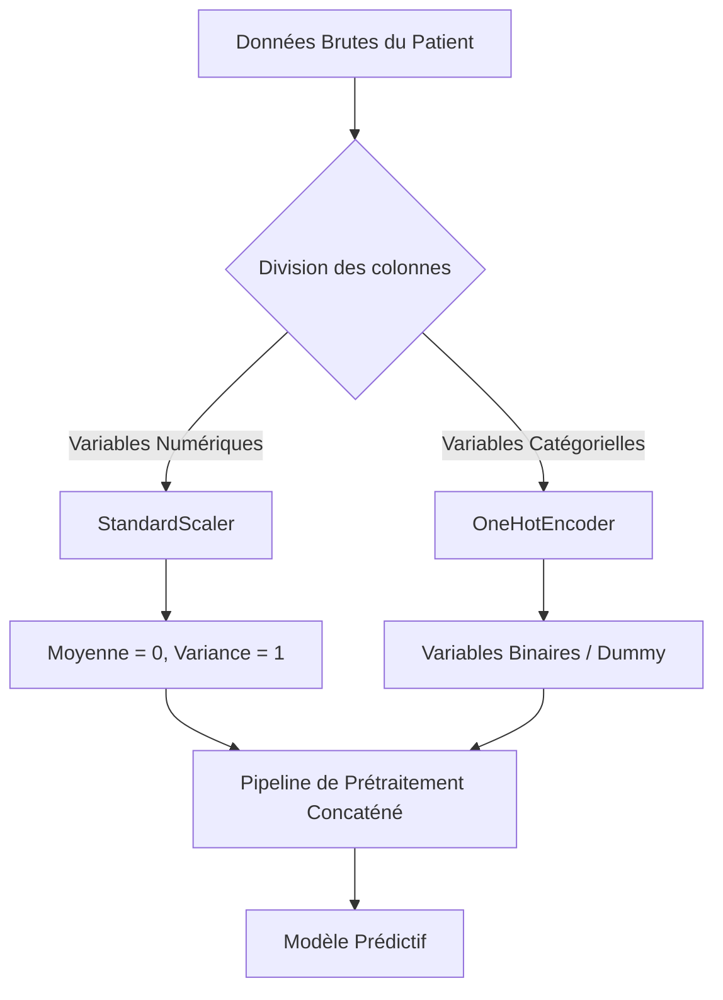

# 🫀 CardioCheck AI - Système Intelligent d'Évaluation du Risque Cardiaque

**CardioCheck AI** est un projet de Machine Learning End-to-End développé dans un cadre académique. Son but est de fournir aux professionnels de santé un outil d'aide à la décision clinique capable de prédire instantanément la probabilité de présence d'une cardiopathie chez un patient à partir de paramètres physiologiques et de résultats d'examens standards.

---

## 📋 Table des Matières
1. [Contexte et Problématique](#-contexte-et-problématique)
2. [Jeu de Données (Dataset)](#-jeu-de-données-dataset)
3. [Architecture du Prétraitement](#-architecture-du-prétraitement)
4. [Modélisation et Optimisation](#-modélisation-et-optimisation)
5. [Interface Application Web (Streamlit)](#-interface-application-web-streamlit)
6. [Structure du Projet](#-structure-du-projet)
7. [Installation et Lancement Local](#-installation-et-lancement-local)
8. [Perspectives](#-perspectives)

---

## 🫵 Contexte et Problématique
Les cardiopathies coronariennes représentent l'une des causes majeures de mortalité dans le monde. Un diagnostic rapide et précis est essentiel pour orienter au mieux le parcours de soins d'un patient. 

**CardioCheck AI** répond à cette problématique en proposant une interface web ergonomique connectée à un modèle d'intelligence artificielle optimisé. Le système évalue le risque cardiaque et fournit un diagnostic probabiliste en maximisant le **Rappel (Recall)** afin de minimiser au maximum le risque de Faux Négatifs (patients malades non détectés).

---

## 📊 Jeu de Données (Dataset)
Le modèle s'appuie sur le dataset clinique `heartdisease` (disponible sur Kaggle). Il comporte plus de **1 000 enregistrements de patients** avec 14 variables clés :
*   **Données démographiques & physiologiques** : Âge, Sexe, Tension artérielle au repos (`trestbps`), Cholestérol sérique (`chol`), Glycémie à jeun (`fbs`).
*   **Données d'examens cardiologiques** : Type de douleur thoracique (`cp`), Électrocardiogramme au repos (`restecg`), Fréquence cardiaque maximale atteinte (`thalach`), Angine de poitrine induite par l'effort (`exang`), Dépression du segment ST (`oldpeak`), Pente du segment ST d'effort (`slope`), Nombre de vaisseaux colorés par fluoroscopie (`ca`), Résultat de la scintigraphie cardiaque (`thal`).
*   **Variable Cible (Target)** : `target_binary` (0 = Pas de maladie, 1 = Présence d'une anomalie cardiaque).

---

## ⚙️ Architecture du Prétraitement
Pour assurer la stabilité et la convergence des modèles mathématiques, les données subissent une préparation automatisée via un pipeline Scikit-Learn (`ColumnTransformer`) :



1.  **Variables Numériques** : Standardisées avec `StandardScaler` pour ramener leur échelle autour de 0.
2.  **Variables Catégorielles** : Encodées en valeurs binaires via `OneHotEncoder` avec suppression de la première modalité (`drop='first'`) pour éviter le piège de la colinéarité.

---

## 🧠 Modélisation et Optimisation
### 1. Phase de Recherche (Notebook `Model.ipynb`)
Pendant la phase exploratoire, **5 modèles de classification** ont été testés et évalués :
*   Régression Logistique
*   Random Forest
*   XGBoost
*   SVM (Support Vector Machine)
*   Gradient Boosting Classifier

### 2. Phase de Production (`train_local.py`)
Pour la mise en production, nous avons retenu et optimisé les deux meilleurs algorithmes avec recherche d'hyperparamètres ciblant le **Rappel** :
*   **Régression Logistique** : Optimisée par `GridSearchCV` (réglage de la force de régularisation `C` et du type de pénalité L1/L2).
*   **XGBoost** : Optimisé par `RandomizedSearchCV` (profondeur des arbres, taux d'apprentissage, poids des classes `scale_pos_weight`).

Le script d'entraînement choisit automatiquement le modèle affichant le meilleur Rappel sur le jeu de test, le ré-entraîne sur l'intégralité du dataset pour capturer un maximum de patterns, puis l'exporte au format sérialisé (`.pkl`) pour l'application web.

---

## 🎈 Interface Application Web (Streamlit)
L'application fournit une interface web moderne et réactive (inspirée du design *Glassmorphism*) :
*   **Saisie intuitive** : Répartie sur des onglets logiques (Données cliniques de base vs Examens spécialisés).
*   **Visualisation du risque** : Une jauge SVG dynamique de 0 à 100% avec code couleur (Vert = Faible, Jaune = Modéré, Rouge = Élevé).
*   **Export de Rapport** : Génération et téléchargement instantané d'un rapport textuel `.txt` pour le dossier médical du patient.

---

## 📁 Structure du Projet
```text
LouaML/
├── app/
│   ├── deployment_model.pkl         # Modèle final entraîné sérialisé
│   ├── deployment_preprocessor.pkl  # Pipeline de prétraitement sérialisé
│   └── streamlit_app.py             # Script de l'application Streamlit
├── data/
│   └── heart_disease.csv            # Copie locale du dataset clinique
├── venv/                            # Environnement virtuel Python (local)
├── Model.ipynb                      # Notebook d'expérimentation (5 modèles)
├── train_local.py                   # Script d'entraînement et d'export du modèle
├── run_local.sh                     # Script shell de démarrage automatisé (Linux/Mac)
├── requirements.txt                 # Dépendances Python du projet
└── README.md                        # Présentation globale du projet
```

---

## 🚀 Installation et Lancement Local

### Prérequis
*   Python 3.10 ou version supérieure installé sur votre machine.

### Démarrage Rapide (Windows)
1. Ouvrez votre terminal (PowerShell ou Command Prompt) dans le dossier du projet :
   ```powershell
   cd "chemin/vers/LouaML"
   ```
2. Créez et activez votre environnement virtuel :
   ```powershell
   python -m venv venv
   .\venv\Scripts\Activate.ps1
   ```
3. Installez les dépendances requises :
   ```powershell
   pip install -r requirements.txt
   ```
4. Exécutez le script d'entraînement pour générer les fichiers modèles (si non présents dans le dossier `app/`) :
   ```powershell
   python train_local.py
   ```
5. Lancez l'application Streamlit :
   ```powershell
   streamlit run app/streamlit_app.py
   ```

L'application s'ouvrira automatiquement à l'adresse locale : `http://localhost:8501`.

---

## 🔮 Perspectives
*   **Explicabilité (XAI)** : Intégration de SHAP (*SHapley Additive exPlanations*) pour expliquer localement chaque prédiction au médecin.
*   **FastAPI & Microservices** : Création d'une API REST pour séparer complètement la logique de calcul de l'interface utilisateur.
*   **Validation Clinique** : Entraînement sur de nouvelles cohortes de données multi-centriques pour améliorer la généralisation du modèle.